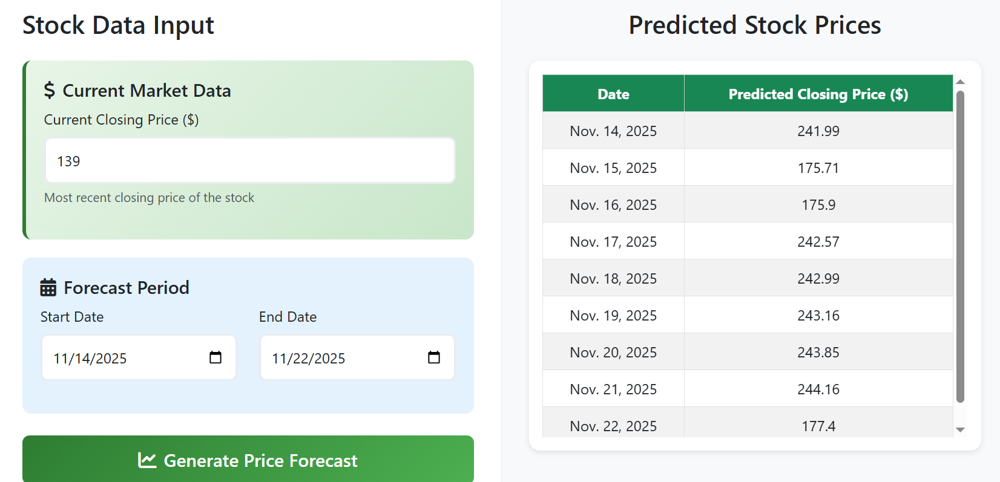

# Stock Price Prediction - ML Project with Django UI

## Description
A machine learning project that predicts Future Stock prices and provides a user-friendly interface built with Django.

## Features
- Predict future Stock prices based on input features.
- Web-based UI using Django.
- Interactive and user-friendly input forms.
- Displays predictions along with date (table form)

## Installation

1. Clone the repository:
```bash
git clone https://github.com/Faisal-Zamir/stock_price_prediction_django_ml.git
```
2. Navigate to the project directory:

```bash
cd stock_price_prediction_django_ml
```
3. Install required packages:
```bash
pip install -r requirements.txt
```
4. Run the Django server:
```bash
python manage.py runserver
```
5. Open your browser at:
```bash
http://127.0.0.1:8000
```
## Usage

To use the Student Performance Prediction application:

- **Step 1:** Fill in student details in the input form.
- **Step 2:** Click the **"Generaet Forcast Price"** button.
- **Step 3:** View the predicted future stock prices.
---

## Dataset

The model is trained on a publicly available dataset from Kaggle:
Link: 
```bash
https://www.kaggle.com/code/pyfaisalzamir/future-stock-price-prediction
```
---

## Model

- **Algorithm:** Prophet

---

## Screenshots

For example:  

- **Home Page:** Screenshot of the form where users input student data AND Prediction Result (Right Sidebar).
- 

**Contributing**

Feel free to open an issue or submit a pull request for improvements.

**Contact**

Faisal Zamir - pyFaisalZamir@gmail.com | JafriCode@gmail.com
GitHub: https://github.com/Faisal-Zamir
